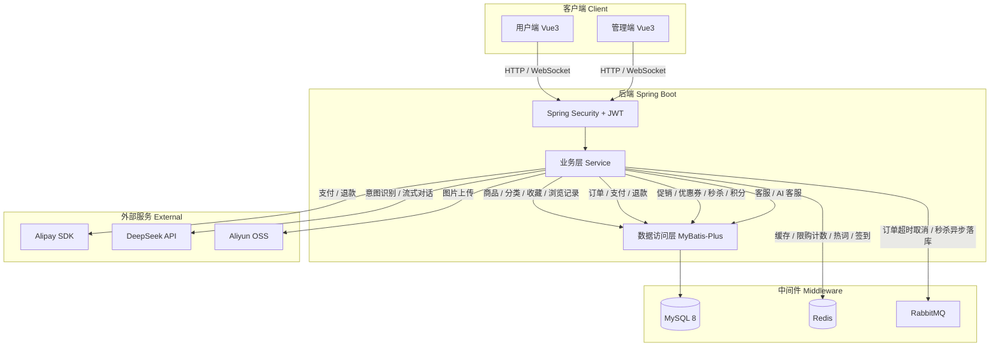

# NexMart 电商平台 | NexMart E-Commerce Platform

> 基于 Spring Boot 3 + Vue 3 的前后端分离单体电商系统，涵盖完整购物流程、促销体系、秒杀、签到、人工客服实时交流、AI 客服等核心业务模块。
>
> A front-end/back-end separated monolithic e-commerce system built with Spring Boot 3 + Vue 3, covering the complete shopping workflow, promotion engine, flash sales, check-in rewards, real-time customer service, AI customer service, and more.

🔗 用户端仓库：GitHub [NexMart-user](https://github.com/EricSu-Dev/NexMart-user) | Gitee [NexMart-user](https://gitee.com/EricSu-Dev/NexMart-user)
🔗 管理端仓库：GitHub [NexMart-admin](https://github.com/EricSu-Dev/NexMart-admin) | Gitee [NexMart-admin](https://gitee.com/EricSu-Dev/NexMart-admin)
---

## 技术栈 | Tech Stack

### 后端 | Backend


### 前端 | Frontend


### 中间件 & 数据库 | Middleware & Database


### 集成 & 工具 | Integrations & Tools


---

## ⭐ 核心技术亮点 | Highlights

**① RabbitMQ 死信队列实现订单超时取消**

订单创建时消息设置 30 分钟 TTL，超时后路由至死信队列触发取消逻辑，回滚库存及优惠券，替代定时任务轮询方案。

**② Redis 多数据结构综合应用**

String 缓存首页商品/轮播图/分类数据、秒杀活动数据、秒杀项数据并预热秒杀库存；Hash 缓存秒杀限购用户已购数；ZSet 存储搜索热词；Bitmap 记录每日签到状态及连续签到天数；结合 Lua 脚本保证秒杀库存扣减的原子性。

**③ 秒杀高并发设计**

绑定活动时从商品实际库存预扣秒杀数量，从源头防止超卖；活动期间预热库存及用户已购数至 Redis，Lua 脚本原子校验并扣减；扣减成功后异步投递 MQ 落库。同时针对秒杀活动列表、秒杀商品、秒杀订单券处理了缓存穿透（空值缓存）、缓存击穿（自实现 Redis 互斥锁：SETNX 加锁 + Lua 脚本原子释放，防止锁过期后误删其他线程持有的锁）、缓存雪崩（随机过期时间）问题。

**④ 多维优惠体系设计**

支持秒杀、促销活动（满减/折扣）、商品优惠券、订单优惠券四种优惠方式，含明确叠加互斥规则（促销活动与订单券互斥，秒杀与其他优惠完全独立）。结算页支持实时价格预览；下单时快照优惠信息至订单表；支付成功、申请退款、待发货取消订单、取消退款申请时通过 WebSocket 实时通知管理端；退款金额原路退回支付宝，并精确回滚对应券及库存。

**⑤ WebSocket 实时客服系统**

基于 Spring WebSocket 实现用户与客服的实时会话，支持文本、图片、商品卡片、订单卡片消息类型，含已读回执与未读消息气泡提醒。

**⑥ Spring AI + DeepSeek 流式 AI 客服与 RAG 知识增强**

集成 Spring AI（OpenAI-compatible 接口）接入 DeepSeek，支持意图识别、动态查询数据库、SSE 流式输出；订单、优惠券、积分、商品库存等实时业务数据通过后端确定性查询，商城规则、购物流程、退款售后、优惠券与秒杀说明通过 RAG 知识召回注入上下文；多轮上下文存储于 Redis，历史记录持久化至 MySQL，搜索无结果时自动降级为 AI 智能推荐。

---

### English Version

**① Order Timeout Cancellation via RabbitMQ Dead-Letter Queue**

Order creation publishes a message with a 30-minute TTL; on expiry it routes to a dead-letter queue, triggers cancellation, and rolls back stock and coupons — replacing polling-based schedulers.

**② Redis Multi-Structure Application**

String caches homepage products/banners/categories, seckill activity/item data, and pre-loaded seckill stock; Hash caches per-user purchase counts for seckill limits; ZSet stores search hot keywords; Bitmap tracks daily check-in status and streaks; Lua scripts ensure atomic stock deduction.

**③ Flash Sale High-Concurrency Design**

Stock for seckill items is pre-deducted from actual inventory at activity binding time; during the event, stock and per-user purchase counts are pre-loaded into Redis and atomically validated/deducted via Lua script; successful deduction triggers async MQ order creation. Cache penetration (null caching), cache breakdown (self-implemented Redis mutex: SETNX lock + Lua atomic release to prevent accidental deletion of other threads' locks), and cache avalanche (randomized TTL) are all addressed for seckill activity lists, items, and coupons.

**④ Multi-Dimensional Promotion System**

Four discount types — flash sale, promotions, product coupons, and order coupons — with explicit stacking rules. Real-time price preview on the checkout page; discount details snapshotted into the order on placement; WebSocket notifies the admin in real time on payment, refund request, pre-shipment cancellation, and refund cancellation; refunds are returned via Alipay and precisely roll back coupons and stock.

**⑤ WebSocket Real-Time Customer Service**

Real-time chat between users and support agents via Spring WebSocket, supporting text, images, product cards, and order cards, with read receipts and unread badge notifications.

**⑥ Spring AI + DeepSeek Streaming AI Assistant & RAG Knowledge Enhancement**

Integrated Spring AI (OpenAI-compatible) with DeepSeek for intent recognition, dynamic DB queries, and SSE streaming output. Real-time business data such as orders, coupons, points, and inventory is queried deterministically by backend services, while store rules, shopping flow, refund policies, coupon rules, and flash-sale instructions are retrieved through a RAG-style knowledge layer and injected into the prompt. Multi-turn context is stored in Redis, history is persisted in MySQL, and search falls back to AI-powered recommendations when no exact results are found.

## 📦 功能模块 | Features

### 用户端 | User Side

**首页**
轮播图展示、搜索框（含热词推荐，无结果自动降级 AI 推荐）、领券中心、秒杀入口、签到入口、热销商品 / 新品上市 / 为你推荐（支持手动配置或按销量 / 更新时间 / 随机自动排列）

**商品**
分类浏览、商品详情（规格选择 / 库存 / 销量）、商品收藏、浏览记录、商品评价（5 星评分 / 点赞 / 二级评论）

**购物与支付**
购物车管理、结算页（优惠券选择 / 实时价格预览）、支付宝扫码支付

**订单**
订单全状态管理（待付款 / 待发货 / 待收货 / 已完成 / 已取消）、确认收货、再次购买、申请退款 / 退款审批流程

**促销**
促销活动（满减 / 折扣）、优惠券（商品券 / 订单券）、限时秒杀（商品秒杀 / 订单券秒杀）

**积分**
每日签到（连续签到里程碑奖励）、积分明细查询、积分商城兑换订单券

**个人中心**
收藏 / 浏览记录、券包管理、地址管理、个人信息修改、手机验证码重置密码

**客服**
人工客服实时会话（文本 / 图片 / 商品卡片 / 订单卡片 / 已读回执）、AI 智能客服（流式输出 / 多轮对话）

---

### 管理端 | Admin Side

含完整后台管理系统，支持概览统计、首页模块管理（轮播图 / 热销 / 新品 / 推荐）、商品与分类管理、促销与优惠券管理、积分与签到管理、秒杀管理、订单与售后管理、客服管理、用户与员工管理。

---
## 🏗️ 系统架构 | Architecture



---
## 🗄️ 数据库设计 | Database Design

共 32 张表，以下列出核心设计决策：

**① 优惠券拆表：`coupon` + `coupon_user`**
`coupon` 存储券模板（面值、类型、有效期、限领数量），`coupon_user` 存储用户持有记录。模板与持有分离，同一券模板可被多人领取，避免数据冗余。

**② 订单快照：`order` + `order_item`**
下单时将商品名称、单价、规格、促销优惠、券优惠、秒杀价等字段快照至订单表，与商品表完全解耦。改价、下架不影响历史订单展示，退款时也可精确还原优惠金额。

**③ 秒杀双表：`seckill_activity` + `seckill_item`**
活动与秒杀项解耦，一个活动可绑定多个秒杀项，且秒杀项支持商品和订单券两种类型（`item_type` 区分），复用同一套活动管理逻辑。

**④ 积分流水：`user_points` + `user_points_log`**
`user_points` 只存当前积分余额，所有变更（签到得分、兑换扣分）全部写入 `user_points_log` 流水表，便于明细查询与积分审计。

**⑤ 首页灵活配置：`home_section` + `home_section_item`**
`home_section` 定义模块（热销商品 / 新品上市 / 为你推荐），`home_section_item` 存储模块内商品。支持手动指定商品或按销量 / 更新时间 / 随机自动填充，扩展新模块无需改动代码。

**⑥ 客服双轨独立：`cs_session/cs_message` + `ai_session/ai_message`**
人工客服与 AI 客服采用独立的会话和消息表，两套体系互不干扰。人工客服侧重实时性（WebSocket + 已读回执），AI 客服侧重上下文管理（Redis 多轮上下文 + MySQL 历史持久化）。

---
## 🚀 快速启动 | Quick Start

### 环境要求 | Prerequisites

| 环境 | 版本 |
|------|------|
| JDK | 21 |
| Node.js | 18+ |
| MySQL | 8 |
| Redis | 7.2 |
| RabbitMQ | 4 |

### 1. 克隆项目 | Clone

GitHub:
```bash
git clone https://github.com/EricSu-Dev/NexMart.git
```

Gitee:
```bash
git clone https://gitee.com/EricSu-Dev/NexMart.git
```
### 2. 初始化数据库 | Database Setup

创建数据库并执行初始化脚本：

```sql
CREATE DATABASE nexmart_db CHARACTER SET utf8mb4 COLLATE utf8mb4_unicode_ci;
```

然后执行 `src/main/resources/sql/nexmart.sql` 导入表结构与初始数据。

> 所有测试账号密码均为 `123456`

### 3. 修改配置 | Configuration

本项目采用双配置文件方式隔离敏感信息：

`application.yml`：非敏感配置，已包含在仓库中

`application-local.yml`：敏感配置，不提交到 Git，需本地自行创建

在 `src/main/resources/` 目录下创建 `application-local.yml`，填入你自己的配置：

```yaml
spring:
  datasource:
    url: jdbc:mysql://xxx.xxx.xxx.xxx:3306/nexmart_db?serverTimezone=Asia/Shanghai&useUnicode=true&characterEncoding=utf-8&useSSL=false&allowPublicKeyRetrieval=true # xxx部分替换成你的mysql地址
    username: # 你的 MySQL 用户名
    password: # 你的 MySQL 密码

  data:
    redis:
      host: # 你的 Redis 地址

  rabbitmq:
    host: # 你的 RabbitMQ 地址

  ai:
    openai:
      api-key: # 你的 DeepSeek API Key

alipay:
  app-id: # 你的沙箱 AppId
  private-key: #你的应用私钥（单行）
  alipay-public-key: #支付宝公钥（单行）
  notify-url: # 支付宝异步回调地址（需公网可访问，本地开发推荐使用 ngrok 内网穿透）

aliyun:
  oss:
    access-key-id: # 你的 AccessKeyId
    access-key-secret: # 你的 AccessKeySecret
```

> ⚠️ **支付宝回调说明**：`notify-url` 必须是公网可访问的地址，本地开发可使用 [ngrok](https://ngrok.com) 做内网穿透：
> ```bash
> ngrok http 8087
> ```
> 将生成的地址填入 `notify-url`，格式如：`https://xxxx.ngrok-free.app/api/user/payment/notify`

### 4. 启动服务 | Start

**后端**（端口 8087）：用 IDEA 直接运行 `NexmartApplication.java`

**用户端前端**（端口 8085）：
```bash
cd NexMart-user
npm install
npm run dev
```

**管理端前端**（端口 8086）：
```bash
cd NexMart-admin
npm install
npm run dev
```

### 5. 访问 | Access

| 端 | 地址 |
|----|------|
| 用户端 | http://localhost:8085 |
| 管理端 | http://localhost:8086 |
| 后端 Swagger | http://localhost:8087/swagger-ui.html |

---
